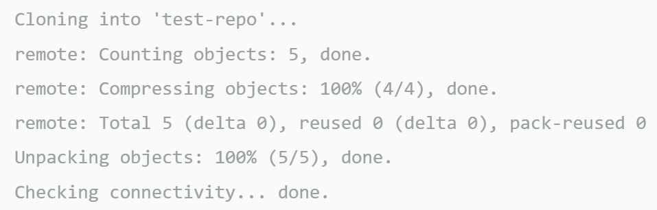

# My Portfolio

## Description
  - This project is intended to kick off my work portfolio

  ### What are the aspects of my website?
    - About me
    - My work and resume
    - Contact information

  - What I learned was how to incorporate media queries and all the adjustments that go into making it responsive.

## Installation:
  - ### Create a new repo on GitHub
      - Go to the upper right corner and click the + icon to create a New Repository
      - Enter a unique repo name (lower case & no spaces)
      - Select License (basic = MIT License)
      - Click Create Repository 

  - ### Clone the repo to a folder on your machine
      - Navagate to the directory you want to clone
      - git clone https://github.com/url-TO_REPO_HERE
          - git clone command - it copies the repo from github  to your local computer
      - git clone https://github.com/YOUR-USERNAME/YOURREPOSITORY
          - Your command line should respond as below.

         

  - ### Navition
      - Navigate to the folder in which you cloned your repo
      - Click on index.html file
      - Double click to open file

## Features:
  - Web Accessibility
  git

## Built with and deployed with:
  - HTML
  - CSS
  - Visual Studios Code
  - Git Bash
  - GitHub
  
## Usage:
  - On your machine navigate to the folder you created.
  - Locate the Index.html file in your browser.
  - https://sheila-ha.github.io/horiseon-01/
  - https://github.com/Sheila-Ha/my-portfolio

## Credits:
The guide used:
 - [Instructions and Starter Code](https://git.bootcampcontent.com/University-of-Minnesota/UofM-VIRT-FSF-PT-10-2023-U-LOLC/-/tree/main/01-HTML-Git-CSS/02-Challenge)

## License:
  - By contributing, you agree that your contribution wil be licensed under its MIT License.